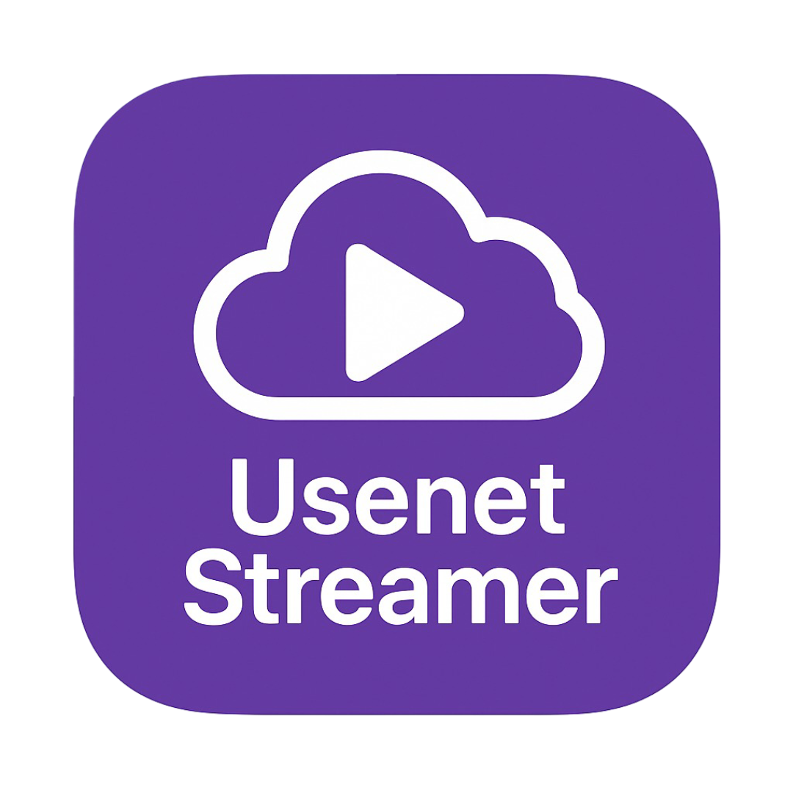

# UsenetStreamer

<p align="center">
  
</p>

Stremio addon that searches Usenet indexers and streams the result through
[InfiniDysk](https://github.com/infinidysk/infinidysk) (maintained NzbDAV fork)
or optional [altMount](https://github.com/javi11/altmount). The addon does not
host media.

This fork runs on **Deno 2** (`Deno.serve`) with Redis for stream/search cache
and SQLite for settings/indexers. Configure it from the Fresh UI on port 8000.

**Disclaimer:** Not affiliated with any Usenet provider or indexer. Offered for
self-hosted, lawful use of content you are entitled to access.

## What this fork does

- Pushes NZBs with **addfile** (no HTTP hairpin back to the LAN IP)
- Waits for a **partial** WebDAV file instead of a finished job
- Talks to InfiniDysk WebDAV on **:8080** (backend), SAB API on **:3000**
- Ranks releases so 1080p WEB-DL tends to start before huge REMUX packs
- Caches ready streams and known failures in Redis
- Optional Prowlarr / NZBHydra2, or direct Newznab indexers via the UI / `manage`

## Quick start (Compose)

```bash
git clone https://github.com/mkcfdc/UsenetStreamer.git
cd UsenetStreamer
git checkout master
cp .env.example .env
# edit .env — see below
docker compose up -d --build
```

| Service | Port | Role |
| --- | --- | --- |
| `usenetstreamer` | 7000 | Stremio addon |
| `usenetstreamer-frontend` | 8000 | Config UI (stop it after setup) |
| `nzbdav` (InfiniDysk) | 3000 UI / 8080 WebDAV | Queue + stream |
| `redis` | 6379 internal | Cache |

Open **http://YOUR_LAN_IP:8000**, save InfiniDysk + indexer settings, then add
this to Stremio:

```
http://YOUR_LAN_IP:7000/YOUR_SHARED_SECRET/manifest.json
```

Remote / phone Stremio needs HTTPS in front of 7000. LAN Stremio accepts HTTP.

## `.env` that matches this stack

Process env **locks** that key in the UI. Leave a key out of `.env` to manage it
from the console. An empty `KEY=` still counts as set.

```env
ADDON_BASE_URL=http://192.168.0.215:7000
PORT=7000
ADDON_SHARED_SECRET=change-this-to-a-long-random-string

# Compose DNS, not the LAN IP
REDIS_URL=redis://redis:6379
ADDON_INTERNAL_URL=http://usenetstreamer:7000

# InfiniDysk — service name stays `nzbdav`
NZBDAV_URL=http://nzbdav:3000
NZBDAV_API_KEY=
NZBDAV_WEBDAV_URL=http://nzbdav:8080
NZBDAV_WEBDAV_USER=admin
NZBDAV_WEBDAV_PASS=
NZBDAV_CATEGORY_MOVIES=Movies
NZBDAV_CATEGORY_SERIES=Tv
NZBDAV_CATEGORY_DEFAULT=Movies
```

WebDAV user/password are **Settings → WebDAV** in InfiniDysk, not the admin UI
login and not the SAB API key. A green test in the Fresh UI only proves the
form values; the addon container reads `.env`.

## InfiniDysk

`nzbdav-dev/nzbdav` is archived. Compose uses `ghcr.io/infinidysk/infinidysk`.
Keep the Compose service name `nzbdav` so existing URLs stay valid. Reuse the
old `./nzbdav` config volume.

Inside InfiniDysk:

1. Settings → SABnzbd — API key must match `NZBDAV_API_KEY`
2. Settings → WebDAV — user/pass must match `NZBDAV_WEBDAV_*`
3. Categories `Movies` and `Tv` (names must match the addon)

Do not run InfiniDysk and altMount at the same time. altMount is the
`altmount` Compose profile.

## Volume permissions

Addon and UI run as uid **1000** and share `usenet-data` at `/app/data`.
Compose runs a `data-init` one-shot that `chown 1000:1000` that volume.
`attempt to write a readonly database` means the volume is still root-owned —
run `docker compose up data-init` then recreate the two app containers.

## Optional

**Direct indexers** — no Prowlarr/Hydra. See [docs/manage_cli.md](docs/manage_cli.md)
or the Indexers section in the UI.

**NZBCheck** — only with a real key. Dummy values (`SUPER_SECURE_KEY`,
`CHANGE_ME`, …) are ignored so they cannot 403 the play path.
See [docs/NzbCheck_Api.md](docs/NzbCheck_Api.md).

**altMount** — `NZBDAV_URL=http://altmount:8080/sabnzbd` and
`NZBDAV_WEBDAV_URL=http://altmount:8080/webdav`. Categories Movies/Tv,
complete dir `/content`. `.strm` is `USE_STRM_FILES=true` plus altMount
import strategy `STRM Files`.

## Published image

```bash
docker pull ghcr.io/mkcfdc/usenetstreamer:latest
```

Build from this tree if you want the current addon (addfile + InfiniDysk
wiring). The GHCR tag lags until CI publishes `master`.

```bash
docker compose build --no-cache usenetstreamer
docker compose up -d --force-recreate usenetstreamer
```

## Related

- [InfiniDysk](https://github.com/infinidysk/infinidysk)
- [altMount](https://github.com/javi11/altmount)
- [Prowlarr](https://github.com/Prowlarr/Prowlarr)
- [NZBHydra2](https://github.com/theotherp/nzbhydra2)
- Upstream concept: [Sanket9225/UsenetStreamer](https://github.com/Sanket9225/UsenetStreamer)
